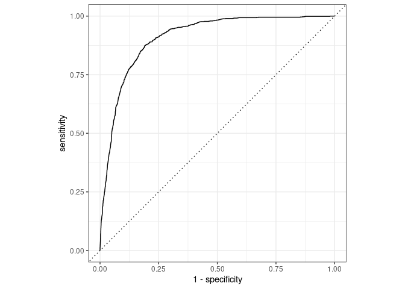

Logistic Model
================

``` r
banking_train <- banking_train %>%
  mutate(y = factor(if_else(y == "yes", 1, 0))) #Changed Outcome Variable to Factor Type
```

``` r
set.seed(45221)
#80-20 Split of Data
banking_split <- initial_split(banking_train, prop = 0.8)
reduced_train_df <-training(banking_split)
banking_test <-testing(banking_split)
nrow(banking_train)
```

    ## [1] 45211

``` r
nrow(banking_test)
```

    ## [1] 9043

``` r
#Model Recipe
banking_rec<- recipe(
  y ~ .,
  data = reduced_train_df
)

banking_rec <- banking_rec %>%
  step_rm( pdays) %>% #Removed this variable due to low impact on model.
  step_cut(campaign, previous, breaks = c(0, 1)) %>% #Only care about values x = 0 and x >= 1 for these variables.
  step_cut(age, breaks = c(25,40,65)) %>% #Created age groups
  step_cut(balance, breaks = c(-0.1, 0.1, 1000, 10000)) %>% #Created balance groups
  step_cut(day, breaks = c(10,20)) %>% #Categorized days variable into beginning, middle, or end of the month.
  step_cut(duration, breaks = c(60, 120, 180, 240, 300, 360, 420, 480, 540, 600)) %>% #Divided Calls by duration in minutes.
  step_dummy(all_nominal(),-all_outcomes()) %>% #Created Dummy Variables
  step_zv(all_predictors()) #Removed Zero Variance Variables
```

``` r
banking_mod <- logistic_reg() %>%
  set_engine("glm")
```

``` r
banking_wflow <-workflow() %>%
  add_model(banking_mod) %>%
  add_recipe(banking_rec)
```

``` r
 banking_fit <- banking_wflow %>%
  fit(data = reduced_train_df)
tidy(banking_fit) 
```

    ## # A tibble: 57 × 5
    ##    term              estimate std.error statistic  p.value
    ##    <chr>                <dbl>     <dbl>     <dbl>    <dbl>
    ##  1 (Intercept)       -5.05       0.434   -11.6    2.84e-31
    ##  2 age_X.25.40.      -0.603      0.107    -5.64   1.75e- 8
    ##  3 age_X.40.65.      -0.601      0.115    -5.23   1.66e- 7
    ##  4 age_X.65.95.       0.00493    0.178     0.0277 9.78e- 1
    ##  5 job_blue.collar   -0.272      0.0818   -3.33   8.70e- 4
    ##  6 job_entrepreneur  -0.339      0.142    -2.38   1.72e- 2
    ##  7 job_housemaid     -0.362      0.153    -2.37   1.80e- 2
    ##  8 job_management    -0.121      0.0839   -1.45   1.48e- 1
    ##  9 job_retired        0.0634     0.115     0.551  5.81e- 1
    ## 10 job_self.employed -0.245      0.125    -1.96   5.02e- 2
    ## # … with 47 more rows

``` r
banking_pred <- predict(banking_fit, banking_test, type = "prob") %>%
  bind_cols(banking_test %>% select(y))

banking_pred %>%
  roc_curve(
    truth = y,
    .pred_1,
    event_level = "second") %>%
  autoplot()
```

<!-- -->

``` r
banking_pred %>%
  roc_auc(
    truth = y,
    .pred_1,
    event_level = "second") 
```

    ## # A tibble: 1 × 3
    ##   .metric .estimator .estimate
    ##   <chr>   <chr>          <dbl>
    ## 1 roc_auc binary         0.908

``` r
cutoff <- 0.5
banking_pred %>%
  mutate(
    subscribed = if_else(y == 1, "Client Subscribed", "Client did not Subscribe"),
    subscribed_pred = if_else(.pred_1>cutoff, "Client Predicted to Subscribe", "Client Predicted to Not Subscribe") )%>%
      count(subscribed_pred, subscribed) %>%
      pivot_wider(names_from = subscribed, values_from = n) %>%
      kable(col.names = c("","Client did not Subscribe", "Client Subscribed")
  )
```

|                                   | Client did not Subscribe | Client Subscribed |
|:----------------------------------|-------------------------:|------------------:|
| Client Predicted to Not Subscribe |                     7731 |               690 |
| Client Predicted to Subscribe     |                      247 |               375 |

``` r
set.seed(777)

folds <-vfold_cv(banking_train, v = 10)
#Divided data into ten folds because of the large dataset size.

banking_fit <- banking_wflow %>%
  fit_resamples(folds)
```

    ## ! Fold03: preprocessor 1/1, model 1/1 (predictions): There are new levels in a fac...

    ## ! Fold04: preprocessor 1/1, model 1/1 (predictions): There are new levels in a fac...

    ## ! Fold10: preprocessor 1/1, model 1/1 (predictions): There are new levels in a fac...

``` r
banking_fit
```

    ## Warning: This tuning result has notes. Example notes on model fitting include:
    ## preprocessor 1/1, model 1/1 (predictions): There are new levels in a factor: NA
    ## preprocessor 1/1, model 1/1 (predictions): There are new levels in a factor: NA
    ## preprocessor 1/1, model 1/1 (predictions): There are new levels in a factor: NA

    ## # Resampling results
    ## # 10-fold cross-validation 
    ## # A tibble: 10 × 4
    ##    splits               id     .metrics         .notes          
    ##    <list>               <chr>  <list>           <list>          
    ##  1 <split [40689/4522]> Fold01 <tibble [2 × 4]> <tibble [0 × 1]>
    ##  2 <split [40690/4521]> Fold02 <tibble [2 × 4]> <tibble [0 × 1]>
    ##  3 <split [40690/4521]> Fold03 <tibble [2 × 4]> <tibble [1 × 1]>
    ##  4 <split [40690/4521]> Fold04 <tibble [2 × 4]> <tibble [1 × 1]>
    ##  5 <split [40690/4521]> Fold05 <tibble [2 × 4]> <tibble [0 × 1]>
    ##  6 <split [40690/4521]> Fold06 <tibble [2 × 4]> <tibble [0 × 1]>
    ##  7 <split [40690/4521]> Fold07 <tibble [2 × 4]> <tibble [0 × 1]>
    ##  8 <split [40690/4521]> Fold08 <tibble [2 × 4]> <tibble [0 × 1]>
    ##  9 <split [40690/4521]> Fold09 <tibble [2 × 4]> <tibble [0 × 1]>
    ## 10 <split [40690/4521]> Fold10 <tibble [2 × 4]> <tibble [1 × 1]>

``` r
collect_metrics(banking_fit)
```

    ## # A tibble: 2 × 6
    ##   .metric  .estimator  mean     n  std_err .config             
    ##   <chr>    <chr>      <dbl> <int>    <dbl> <chr>               
    ## 1 accuracy binary     0.899    10 0.000701 Preprocessor1_Model1
    ## 2 roc_auc  binary     0.910    10 0.00145  Preprocessor1_Model1
