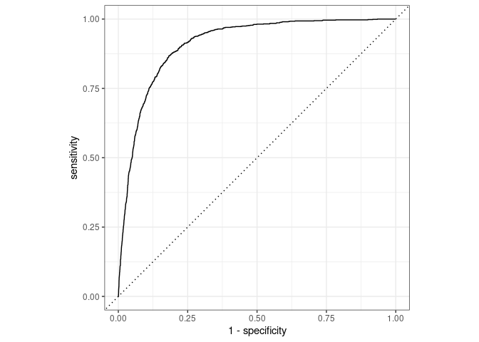

Code Tester
================

``` r
banking_train<- read_delim("/cloud/project/data/Banking Dataset.csv",
            delim = ";", escape_double = FALSE, trim_ws = TRUE)
```

    ## Rows: 45211 Columns: 17

    ## ── Column specification ────────────────────────────────────────────────────────
    ## Delimiter: ";"
    ## chr (10): job, marital, education, default, housing, loan, contact, month, p...
    ## dbl  (7): age, balance, day, duration, campaign, pdays, previous

    ## 
    ## ℹ Use `spec()` to retrieve the full column specification for this data.
    ## ℹ Specify the column types or set `show_col_types = FALSE` to quiet this message.

``` r
rename(banking_train, yes=y)
```

    ## # A tibble: 45,211 × 17
    ##      age job       marital education default balance housing loan  contact   day
    ##    <dbl> <chr>     <chr>   <chr>     <chr>     <dbl> <chr>   <chr> <chr>   <dbl>
    ##  1    58 manageme… married tertiary  no         2143 yes     no    unknown     5
    ##  2    44 technici… single  secondary no           29 yes     no    unknown     5
    ##  3    33 entrepre… married secondary no            2 yes     yes   unknown     5
    ##  4    47 blue-col… married unknown   no         1506 yes     no    unknown     5
    ##  5    33 unknown   single  unknown   no            1 no      no    unknown     5
    ##  6    35 manageme… married tertiary  no          231 yes     no    unknown     5
    ##  7    28 manageme… single  tertiary  no          447 yes     yes   unknown     5
    ##  8    42 entrepre… divorc… tertiary  yes           2 yes     no    unknown     5
    ##  9    58 retired   married primary   no          121 yes     no    unknown     5
    ## 10    43 technici… single  secondary no          593 yes     no    unknown     5
    ## # … with 45,201 more rows, and 7 more variables: month <chr>, duration <dbl>,
    ## #   campaign <dbl>, pdays <dbl>, previous <dbl>, poutcome <chr>, yes <chr>

``` r
banking_train <- banking_train %>%
  mutate(y = factor(if_else(y == "yes", 1, 0)))
```

``` r
set.seed(45211)
######
banking_split <- initial_split(banking_train, prop = 0.8)
reduced_train_df <-training(banking_split)
banking_test <-testing(banking_split)
glimpse(reduced_train_df)
```

    ## Rows: 36,168
    ## Columns: 17
    ## $ age       <dbl> 51, 50, 60, 61, 51, 48, 46, 29, 33, 35, 37, 29, 39, 38, 45, …
    ## $ job       <chr> "blue-collar", "technician", "management", "management", "ho…
    ## $ marital   <chr> "married", "married", "married", "married", "married", "marr…
    ## $ education <chr> "primary", "secondary", "tertiary", "secondary", "primary", …
    ## $ default   <chr> "no", "no", "no", "no", "no", "no", "no", "no", "no", "no", …
    ## $ balance   <dbl> 1466, 416, 73, 967, 0, 51, 2291, 473, 88, 533, 1148, 57, 3, …
    ## $ housing   <chr> "yes", "yes", "no", "no", "yes", "yes", "no", "yes", "yes", …
    ## $ loan      <chr> "no", "no", "no", "no", "no", "yes", "no", "yes", "no", "no"…
    ## $ contact   <chr> "unknown", "unknown", "telephone", "cellular", "telephone", …
    ## $ day       <dbl> 7, 5, 8, 20, 30, 2, 17, 9, 9, 6, 12, 21, 3, 3, 25, 6, 7, 4, …
    ## $ month     <chr> "may", "jun", "aug", "aug", "jul", "feb", "jun", "may", "may…
    ## $ duration  <dbl> 406, 494, 243, 180, 191, 90, 218, 180, 57, 221, 259, 342, 20…
    ## $ campaign  <dbl> 2, 5, 2, 1, 3, 1, 1, 2, 2, 12, 1, 9, 1, 3, 4, 1, 1, 3, 11, 1…
    ## $ pdays     <dbl> -1, -1, -1, -1, -1, 262, -1, -1, -1, -1, -1, -1, -1, -1, -1,…
    ## $ previous  <dbl> 0, 0, 0, 0, 0, 1, 0, 0, 0, 0, 0, 0, 0, 0, 0, 4, 0, 0, 0, 8, …
    ## $ poutcome  <chr> "unknown", "unknown", "unknown", "unknown", "unknown", "fail…
    ## $ y         <fct> 0, 1, 1, 0, 0, 0, 0, 0, 0, 0, 0, 0, 0, 0, 0, 1, 0, 0, 0, 0, …

``` r
glimpse(banking_test)
```

    ## Rows: 9,043
    ## Columns: 17
    ## $ age       <dbl> 47, 33, 35, 28, 43, 41, 45, 28, 44, 36, 49, 59, 60, 58, 36, …
    ## $ job       <chr> "blue-collar", "unknown", "management", "management", "techn…
    ## $ marital   <chr> "married", "single", "married", "single", "single", "divorce…
    ## $ education <chr> "unknown", "unknown", "tertiary", "tertiary", "secondary", "…
    ## $ default   <chr> "no", "no", "no", "no", "no", "no", "no", "no", "no", "no", …
    ## $ balance   <dbl> 1506, 1, 231, 447, 593, 270, 13, 723, -372, 265, 378, 0, 104…
    ## $ housing   <chr> "yes", "no", "yes", "yes", "yes", "yes", "yes", "yes", "yes"…
    ## $ loan      <chr> "no", "no", "no", "yes", "no", "no", "no", "yes", "no", "yes…
    ## $ contact   <chr> "unknown", "unknown", "unknown", "unknown", "unknown", "unkn…
    ## $ day       <dbl> 5, 5, 5, 5, 5, 5, 5, 5, 5, 5, 5, 5, 5, 5, 5, 5, 5, 5, 5, 5, …
    ## $ month     <chr> "may", "may", "may", "may", "may", "may", "may", "may", "may…
    ## $ duration  <dbl> 92, 198, 139, 217, 55, 222, 98, 262, 172, 348, 230, 226, 22,…
    ## $ campaign  <dbl> 1, 1, 1, 1, 1, 1, 1, 1, 1, 1, 1, 1, 1, 1, 1, 1, 1, 1, 1, 1, …
    ## $ pdays     <dbl> -1, -1, -1, -1, -1, -1, -1, -1, -1, -1, -1, -1, -1, -1, -1, …
    ## $ previous  <dbl> 0, 0, 0, 0, 0, 0, 0, 0, 0, 0, 0, 0, 0, 0, 0, 0, 0, 0, 0, 0, …
    ## $ poutcome  <chr> "unknown", "unknown", "unknown", "unknown", "unknown", "unkn…
    ## $ y         <fct> 0, 0, 0, 0, 0, 0, 0, 0, 0, 0, 0, 0, 0, 0, 0, 0, 0, 0, 0, 0, …

``` r
trial_fit <- logistic_reg() %>%
  set_engine("glm") %>%
  fit(y ~ ., data = reduced_train_df, family = "binomial")
trial_fit
```

    ## parsnip model object
    ## 
    ## Fit time:  1.2s 
    ## 
    ## Call:  stats::glm(formula = y ~ ., family = stats::binomial, data = data)
    ## 
    ## Coefficients:
    ##        (Intercept)                 age      jobblue-collar     jobentrepreneur  
    ##         -2.511e+00          -1.276e-03          -2.953e-01          -2.380e-01  
    ##       jobhousemaid       jobmanagement          jobretired    jobself-employed  
    ##         -5.566e-01          -1.475e-01           2.827e-01          -3.062e-01  
    ##        jobservices          jobstudent       jobtechnician       jobunemployed  
    ##         -2.633e-01           3.247e-01          -1.856e-01          -2.085e-01  
    ##         jobunknown      maritalmarried       maritalsingle  educationsecondary  
    ##         -4.237e-01          -1.622e-01           1.013e-01           1.736e-01  
    ##  educationtertiary    educationunknown          defaultyes             balance  
    ##          3.518e-01           1.791e-01          -2.740e-02           1.082e-05  
    ##         housingyes             loanyes    contacttelephone      contactunknown  
    ##         -6.515e-01          -4.535e-01          -1.174e-01          -1.585e+00  
    ##                day            monthaug            monthdec            monthfeb  
    ##          9.354e-03          -6.975e-01           6.201e-01          -1.228e-01  
    ##           monthjan            monthjul            monthjun            monthmar  
    ##         -1.247e+00          -8.019e-01           4.528e-01           1.596e+00  
    ##           monthmay            monthnov            monthoct            monthsep  
    ##         -4.344e-01          -8.995e-01           1.021e+00           8.865e-01  
    ##           duration            campaign               pdays            previous  
    ##          4.202e-03          -8.876e-02          -1.590e-04           1.046e-02  
    ##      poutcomeother     poutcomesuccess     poutcomeunknown  
    ##          2.257e-01           2.372e+00          -5.754e-02  
    ## 
    ## Degrees of Freedom: 36167 Total (i.e. Null);  36125 Residual
    ## Null Deviance:       26200 
    ## Residual Deviance: 17270     AIC: 17350

``` r
banking_pred <- predict(trial_fit, banking_test, type = "prob") %>%
  bind_cols(banking_test %>% select(y))

banking_pred %>%
  roc_curve(
    truth = y,
    .pred_1,
    event_level = "second") %>%
  autoplot()
```

<!-- -->

``` r
banking_pred %>%
  roc_auc(
    truth = y,
    .pred_1,
    event_level = "second") 
```

    ## # A tibble: 1 × 3
    ##   .metric .estimator .estimate
    ##   <chr>   <chr>          <dbl>
    ## 1 roc_auc binary         0.910

``` r
ggpairs(banking_test)
```

    ## `stat_bin()` using `bins = 30`. Pick better value with `binwidth`.
    ## `stat_bin()` using `bins = 30`. Pick better value with `binwidth`.
    ## `stat_bin()` using `bins = 30`. Pick better value with `binwidth`.
    ## `stat_bin()` using `bins = 30`. Pick better value with `binwidth`.
    ## `stat_bin()` using `bins = 30`. Pick better value with `binwidth`.
    ## `stat_bin()` using `bins = 30`. Pick better value with `binwidth`.
    ## `stat_bin()` using `bins = 30`. Pick better value with `binwidth`.
    ## `stat_bin()` using `bins = 30`. Pick better value with `binwidth`.
    ## `stat_bin()` using `bins = 30`. Pick better value with `binwidth`.
    ## `stat_bin()` using `bins = 30`. Pick better value with `binwidth`.
    ## `stat_bin()` using `bins = 30`. Pick better value with `binwidth`.
    ## `stat_bin()` using `bins = 30`. Pick better value with `binwidth`.
    ## `stat_bin()` using `bins = 30`. Pick better value with `binwidth`.
    ## `stat_bin()` using `bins = 30`. Pick better value with `binwidth`.
    ## `stat_bin()` using `bins = 30`. Pick better value with `binwidth`.
    ## `stat_bin()` using `bins = 30`. Pick better value with `binwidth`.
    ## `stat_bin()` using `bins = 30`. Pick better value with `binwidth`.
    ## `stat_bin()` using `bins = 30`. Pick better value with `binwidth`.
    ## `stat_bin()` using `bins = 30`. Pick better value with `binwidth`.
    ## `stat_bin()` using `bins = 30`. Pick better value with `binwidth`.
    ## `stat_bin()` using `bins = 30`. Pick better value with `binwidth`.
    ## `stat_bin()` using `bins = 30`. Pick better value with `binwidth`.
    ## `stat_bin()` using `bins = 30`. Pick better value with `binwidth`.
    ## `stat_bin()` using `bins = 30`. Pick better value with `binwidth`.
    ## `stat_bin()` using `bins = 30`. Pick better value with `binwidth`.
    ## `stat_bin()` using `bins = 30`. Pick better value with `binwidth`.
    ## `stat_bin()` using `bins = 30`. Pick better value with `binwidth`.
    ## `stat_bin()` using `bins = 30`. Pick better value with `binwidth`.
    ## `stat_bin()` using `bins = 30`. Pick better value with `binwidth`.
    ## `stat_bin()` using `bins = 30`. Pick better value with `binwidth`.
    ## `stat_bin()` using `bins = 30`. Pick better value with `binwidth`.
    ## `stat_bin()` using `bins = 30`. Pick better value with `binwidth`.
    ## `stat_bin()` using `bins = 30`. Pick better value with `binwidth`.
    ## `stat_bin()` using `bins = 30`. Pick better value with `binwidth`.
    ## `stat_bin()` using `bins = 30`. Pick better value with `binwidth`.
    ## `stat_bin()` using `bins = 30`. Pick better value with `binwidth`.
    ## `stat_bin()` using `bins = 30`. Pick better value with `binwidth`.
    ## `stat_bin()` using `bins = 30`. Pick better value with `binwidth`.
    ## `stat_bin()` using `bins = 30`. Pick better value with `binwidth`.
    ## `stat_bin()` using `bins = 30`. Pick better value with `binwidth`.
    ## `stat_bin()` using `bins = 30`. Pick better value with `binwidth`.
    ## `stat_bin()` using `bins = 30`. Pick better value with `binwidth`.
    ## `stat_bin()` using `bins = 30`. Pick better value with `binwidth`.
    ## `stat_bin()` using `bins = 30`. Pick better value with `binwidth`.
    ## `stat_bin()` using `bins = 30`. Pick better value with `binwidth`.
    ## `stat_bin()` using `bins = 30`. Pick better value with `binwidth`.
    ## `stat_bin()` using `bins = 30`. Pick better value with `binwidth`.
    ## `stat_bin()` using `bins = 30`. Pick better value with `binwidth`.
    ## `stat_bin()` using `bins = 30`. Pick better value with `binwidth`.
    ## `stat_bin()` using `bins = 30`. Pick better value with `binwidth`.
    ## `stat_bin()` using `bins = 30`. Pick better value with `binwidth`.
    ## `stat_bin()` using `bins = 30`. Pick better value with `binwidth`.
    ## `stat_bin()` using `bins = 30`. Pick better value with `binwidth`.
    ## `stat_bin()` using `bins = 30`. Pick better value with `binwidth`.
    ## `stat_bin()` using `bins = 30`. Pick better value with `binwidth`.
    ## `stat_bin()` using `bins = 30`. Pick better value with `binwidth`.
    ## `stat_bin()` using `bins = 30`. Pick better value with `binwidth`.
    ## `stat_bin()` using `bins = 30`. Pick better value with `binwidth`.
    ## `stat_bin()` using `bins = 30`. Pick better value with `binwidth`.
    ## `stat_bin()` using `bins = 30`. Pick better value with `binwidth`.
    ## `stat_bin()` using `bins = 30`. Pick better value with `binwidth`.
    ## `stat_bin()` using `bins = 30`. Pick better value with `binwidth`.
    ## `stat_bin()` using `bins = 30`. Pick better value with `binwidth`.
    ## `stat_bin()` using `bins = 30`. Pick better value with `binwidth`.
    ## `stat_bin()` using `bins = 30`. Pick better value with `binwidth`.
    ## `stat_bin()` using `bins = 30`. Pick better value with `binwidth`.
    ## `stat_bin()` using `bins = 30`. Pick better value with `binwidth`.
    ## `stat_bin()` using `bins = 30`. Pick better value with `binwidth`.
    ## `stat_bin()` using `bins = 30`. Pick better value with `binwidth`.
    ## `stat_bin()` using `bins = 30`. Pick better value with `binwidth`.

<!-- -->
