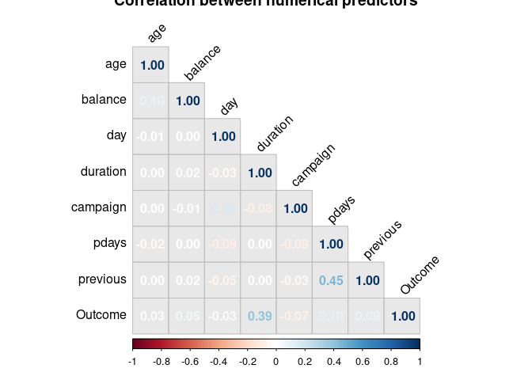

Code Tester
================

``` r
banking_train<- read_delim("/cloud/project/data/Banking Dataset.csv",
            delim = ";", escape_double = FALSE, trim_ws = TRUE)
```

    ## Rows: 45211 Columns: 17

    ## ── Column specification ────────────────────────────────────────────────────────
    ## Delimiter: ";"
    ## chr (10): job, marital, education, default, housing, loan, contact, month, p...
    ## dbl  (7): age, balance, day, duration, campaign, pdays, previous

    ## 
    ## ℹ Use `spec()` to retrieve the full column specification for this data.
    ## ℹ Specify the column types or set `show_col_types = FALSE` to quiet this message.

``` r
cor <-banking_train %>%
  mutate(Outcome = if_else(y == "yes", 1, 0)) %>%
  summarize(age, balance, day, duration, campaign, pdays, previous,Outcome) %>%
cor(method = "pearson")

corrplot(cor,type = "lower", bg = "#e8e8e8", method = c("number"), order = "original", title = "Correlation between numerical predictors", tl.col = "black", tl.srt = 45)
```

<!-- -->
