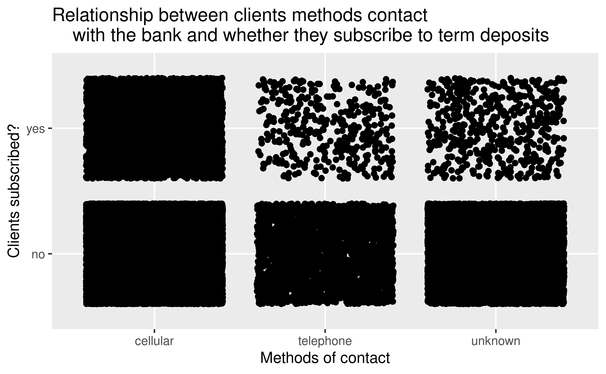
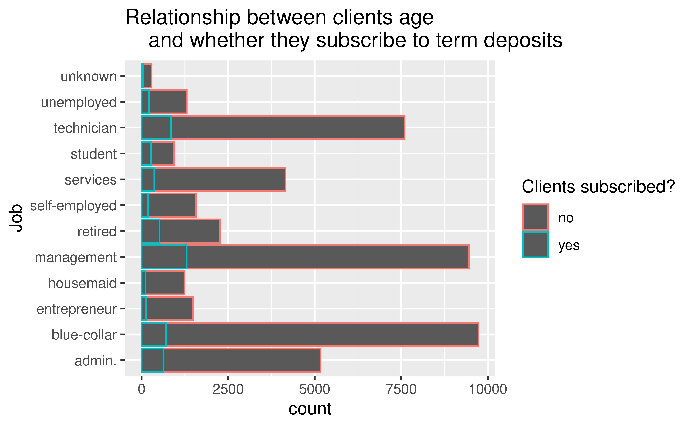
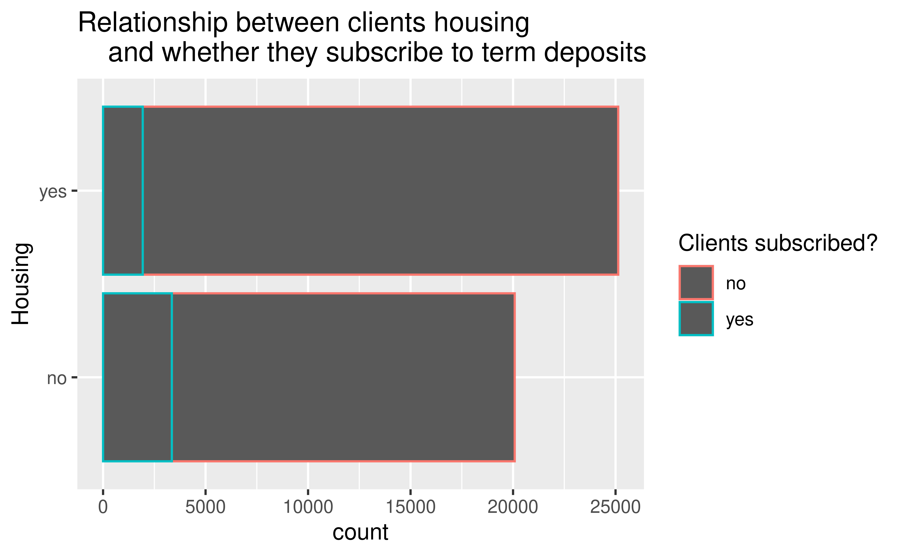

# Our question 


Which variables (or combinations of these) are the most important indicators when determining whether an individual will subscribe to a term deposit? Can we use these to build a predictive model? 

# Our Methodology

We built a logistic regression model to answer which variables are the most important indicators when determining whether an individual will subscribe to a term deposit. Firstly, we made some preliminary data analysis and visualizations to get a general gist of our data. We then used advanced statistical and modelling techniques to create an adequate model and finally tested it in a separate set of data it had never seen before to properly assess its performance.

# Our Dataset

The original data collection comes from the 2008-2013 records of a Portuguese Banking Institution and their success in convincing clients to subscribe to term deposits. It is called "Banking Dataset - Marketing Targets" by Prakhar Rathi and contains data derived from *S. Moro, P. Cortez and P. Rita.-A Data-Driven Approach to Predict the Success of Bank Telemarketing*. 

# The General Picture

The results of the marketing campaign are as follows:


----

Could the client's jobs have had an impact on whether they subscribed to term deposits?


----

----


----

----

----

Which numerical variables have the the strongest correlation? Is there some collinearity perhaps?

<font size = '6'>**Correlation between numerical predictors**</font>


# Our Model Plan 


# How we Split Our Data


```r
set.seed(45221)

#80-20 Split of Data

banking_split <- initial_split(banking_train, prop = 0.8)
reduced_train_df <-training(banking_split)
reduced_test_df <-testing(banking_split)
```
Number of Rows in Sub-Train Dataframe:

```
## [1] 36168
```
Number of Rows in Sub-Test Dataframe:

```
## [1] 9043
```

# Our Recipe

The recipe we used for this particular model can be observed below:

1. We removed the pdays variable because it had minimal correlation with our outcome.
2. We cut the campaign variable in breaks of 0 and 1.
3. We created relevant age groups.
4. We created times of the month from the day variable.
5. We classified calls by their duration in minutes rather than seconds.
6. We created dummy variables and removed zero variance variables.

----


```r
banking_rec<- recipe(
  y ~ .,
  data = reduced_train_df
)

banking_rec <- banking_rec %>%
  step_rm(pdays) %>% 
  #Removed this variable due to low impact on model.
  step_cut(campaign, previous, breaks = c(0, 1)) %>% 
  #Only care about values x = 0 and x >= 1 for these variables.
  step_cut(age, breaks = c(25,40,65)) %>% 
  #Created age groups
  step_cut(balance, breaks = c(-0.1, 0.1, 1000, 10000)) %>% 
  #Created balance groups
  step_cut(day, breaks = c(10,20)) %>% 
  #Categorized days variable into beginning, middle, or end of the month.
  step_cut(duration, breaks = c(60, 120, 180, 240, 300, 360, 420, 480, 540, 600)) %>% 
  #Divided Calls by duration in minutes.
  step_dummy(all_nominal(),-all_outcomes()) %>% 
  #Created Dummy Variables
  step_zv(all_predictors()) 
  #Removed Zero Variance Variables
```
 
# Fitting it all together


We applied our recipe into a workflow and fitted it all into a model.

```r
 banking_fit <- banking_wflow %>%
  fit(data = reduced_train_df)
```
----

```
## # A tibble: 57 × 5
##    term              estimate std.error statistic  p.value
##    <chr>                <dbl>     <dbl>     <dbl>    <dbl>
##  1 (Intercept)       -5.05       0.434   -11.6    2.84e-31
##  2 age_X.25.40.      -0.603      0.107    -5.64   1.75e- 8
##  3 age_X.40.65.      -0.601      0.115    -5.23   1.66e- 7
##  4 age_X.65.95.       0.00493    0.178     0.0277 9.78e- 1
##  5 job_blue.collar   -0.272      0.0818   -3.33   8.70e- 4
##  6 job_entrepreneur  -0.339      0.142    -2.38   1.72e- 2
##  7 job_housemaid     -0.362      0.153    -2.37   1.80e- 2
##  8 job_management    -0.121      0.0839   -1.45   1.48e- 1
##  9 job_retired        0.0634     0.115     0.551  5.81e- 1
## 10 job_self.employed -0.245      0.125    -1.96   5.02e- 2
## # … with 47 more rows
```

# Initial Results


# Cross Validation


# Final Test


# Conclusion


# Ethics

However, even after all this analysis and correlation, each person's ethics can affect the results in a way that is unpredictable.

. . . 

- Loyalty; If the client is loyal to their bank and another bank tries to make him subscribe to a term deposit, it may be that he rejects only because of his loyalty towards his bank.

. . . 

- Trustworthiness; If the client doesn't know about the bank and how well it does normally, he decides not to trust it despite was he is being told.
