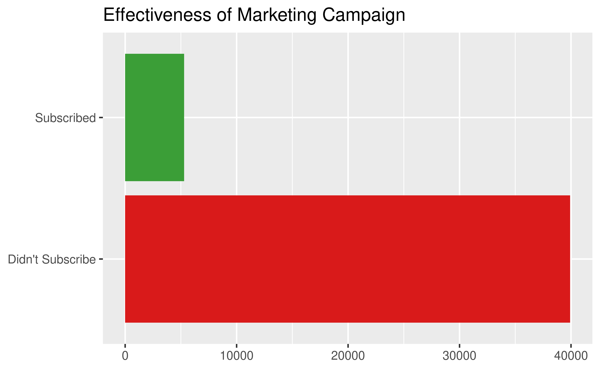
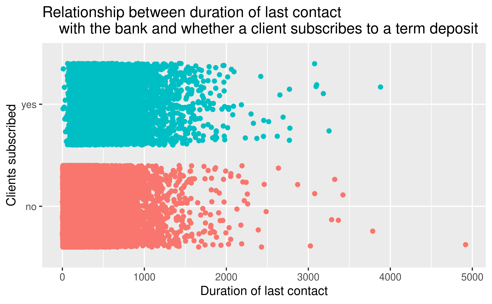
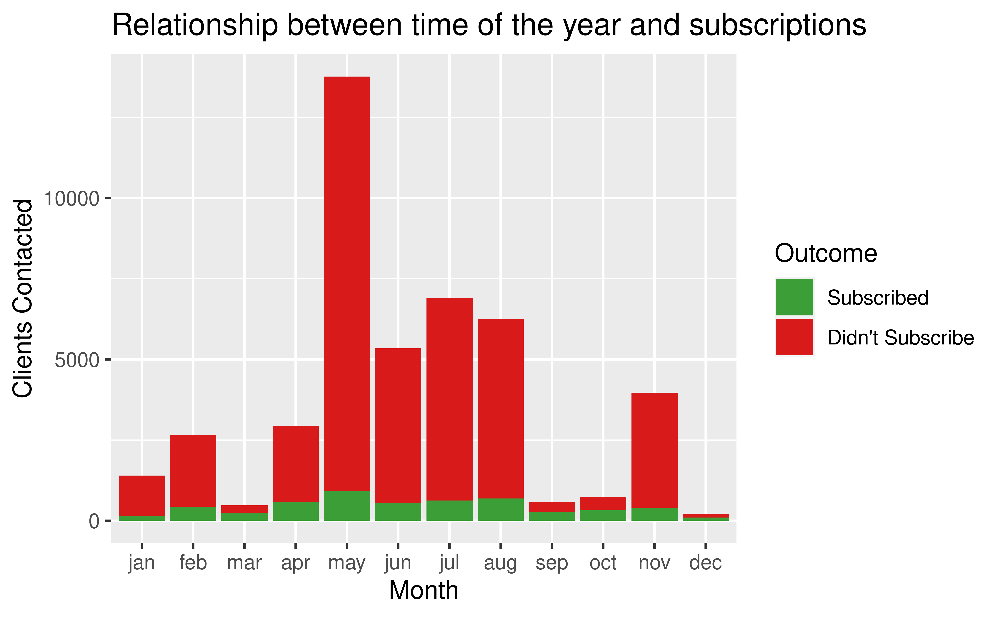
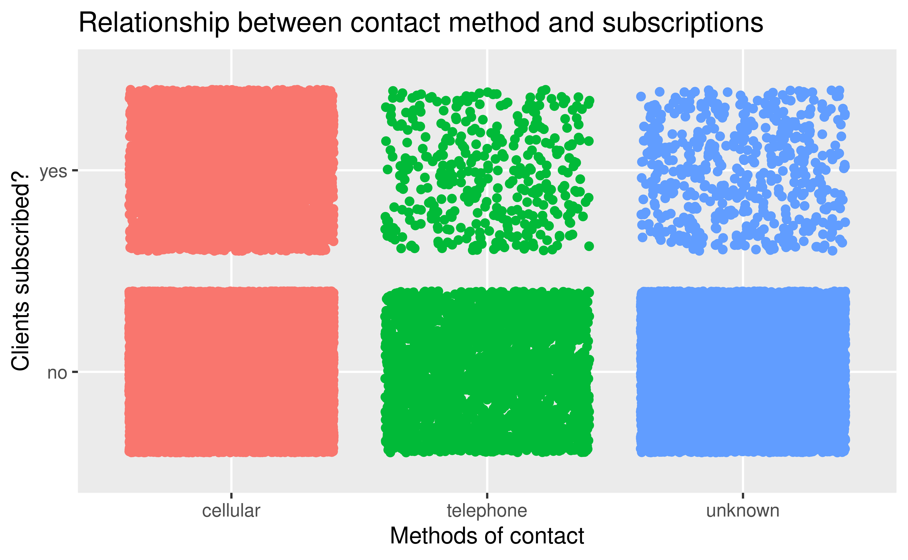
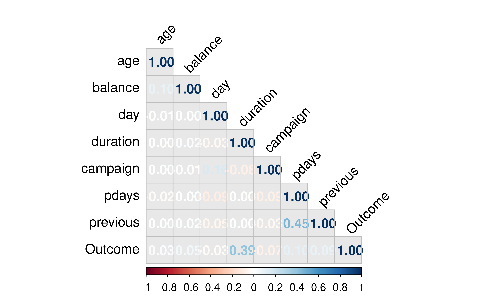
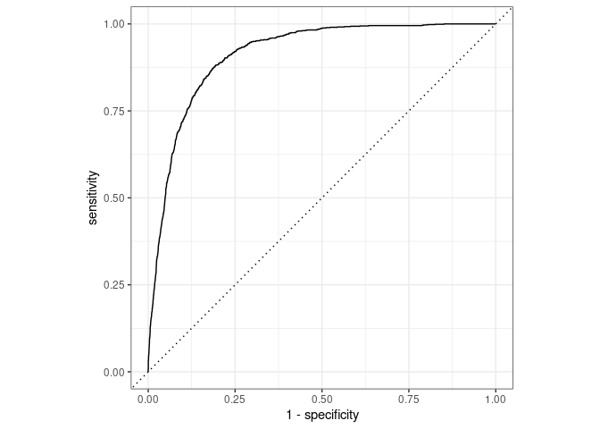

# Our question {data-background-image="img/Theme.png"}


Which variables (or combinations of these) are the most important indicators when determining whether an individual will subscribe to a term deposit? Can we use these to build a predictive model? 

# Our Methodology {data-background-image="img/Theme.png"}

We built a logistic regression model to answer which variables are the most important indicators when determining whether an individual will subscribe to a term deposit. Firstly, we made some preliminary data analysis and visualizations to get a general gist of our data. We then used advanced statistical and modelling techniques to create an adequate model and finally tested it in a separate set of data it had never seen before to properly assess its performance.

# Our Dataset {data-background-image="img/Theme.png"}

The original data collection comes from the 2008-2013 records of a Portuguese Banking Institution and their success in convincing clients to subscribe to term deposits. It is called "Banking Dataset - Marketing Targets" by Prakhar Rathi and contains data derived from *S. Moro, P. Cortez and P. Rita.-A Data-Driven Approach to Predict the Success of Bank Telemarketing*. 

# The General Picture {data-background-image="img/Theme.png"}

The results of the marketing campaign are as follows:




----
#{data-background-image="img/Theme.png"}
Could the client's jobs have had an impact on whether they subscribed to term deposits?


----
#{data-background-image="img/Theme.png"}
Could the client's duration of their last contact have had an impact on whether they subscribed to term deposits?


----
#{data-background-image="img/Theme.png"}
Is there a connection between the clients decision and what month of the year it is?



----
#{data-background-image="img/Theme.png"}
Is there a correlation between how the client was contacted and if they subscribed to the term deposit?



----
#{data-background-image="img/Theme.png"}
Do the number of days since the client has been contacted matter?


----
#{data-background-image="img/Theme.png"}
Which numerical variables have the the strongest correlation? Is there some collinearity perhaps?

<font size = '6'>**Correlation between numerical predictors**</font>

# Logistic Regression Model {data-background-image="img/Theme2.png"}

# How we Split Our Data {data-background-image="img/Theme.png"}


```r
set.seed(45221)

#80-20 Split of Data

banking_split <- initial_split(banking_train, prop = 0.8)
reduced_train_df <-training(banking_split)
reduced_test_df <-testing(banking_split)
```
Number of Rows in Sub-Train Dataframe:

```
## [1] 36168
```
Number of Rows in Sub-Test Dataframe:

```
## [1] 9043
```

# Our Recipe {data-background-image="img/Theme.png"}
The recipe we used for this particular model can be observed below:

1. We removed the pdays variable because it had minimal correlation with our outcome.
2. We cut the campaign variable in breaks of 0 and 1.
3. We created relevant age groups.
4. We created times of the month from the day variable.
5. We classified calls by their duration in minutes rather than seconds.
6. We created dummy variables and removed zero variance variables.


----


```r
banking_rec<- recipe(
  y ~ .,
  data = reduced_train_df
)

banking_rec <- banking_rec %>%
  step_rm(pdays) %>% 
  #Removed this variable due to low impact on model.
  step_cut(campaign, previous, breaks = c(0, 1)) %>% 
  #Only care about values x = 0 and x >= 1 for these variables.
  step_cut(age, breaks = c(25,40,65)) %>% 
  #Created age groups
  step_cut(balance, breaks = c(-0.1, 0.1, 1000, 10000)) %>% 
  #Created balance groups
  step_cut(day, breaks = c(10,20)) %>% 
  #Categorized days variable into beginning, middle, or end of the month.
  step_cut(duration, breaks = c(60, 120, 180, 240, 300, 360, 420, 480, 540, 600)) %>% 
  #Divided Calls by duration in minutes.
  step_dummy(all_nominal(),-all_outcomes()) %>% 
  #Created Dummy Variables
  step_zv(all_predictors()) 
  #Removed Zero Variance Variables
```
 
# Fitting it all together {data-background-image="img/Theme.png"}


We applied our recipe into a workflow and fitted it all into a model.

```r
 banking_fit <- banking_wflow %>%
  fit(data = reduced_train_df)
```

----


```
## # A tibble: 57 × 5
##    term              estimate std.error statistic  p.value
##    <chr>                <dbl>     <dbl>     <dbl>    <dbl>
##  1 (Intercept)       -5.05       0.434   -11.6    2.84e-31
##  2 age_X.25.40.      -0.603      0.107    -5.64   1.75e- 8
##  3 age_X.40.65.      -0.601      0.115    -5.23   1.66e- 7
##  4 age_X.65.95.       0.00493    0.178     0.0277 9.78e- 1
##  5 job_blue.collar   -0.272      0.0818   -3.33   8.70e- 4
##  6 job_entrepreneur  -0.339      0.142    -2.38   1.72e- 2
##  7 job_housemaid     -0.362      0.153    -2.37   1.80e- 2
##  8 job_management    -0.121      0.0839   -1.45   1.48e- 1
##  9 job_retired        0.0634     0.115     0.551  5.81e- 1
## 10 job_self.employed -0.245      0.125    -1.96   5.02e- 2
## # … with 47 more rows
```

# Initial Results {data-background-image="img/Theme.png"}


```
## # A tibble: 1 × 3
##   .metric .estimator .estimate
##   <chr>   <chr>          <dbl>
## 1 roc_auc binary         0.908
```

----

# Results Matrix {data-background-image="img/Theme.png"}

<table>
 <thead>
  <tr>
   <th style="text-align:left;">  </th>
   <th style="text-align:right;"> Client did not Subscribe </th>
   <th style="text-align:right;"> Client Subscribed </th>
  </tr>
 </thead>
<tbody>
  <tr>
   <td style="text-align:left;"> Client Predicted Not to Subscribe </td>
   <td style="text-align:right;"> 7731 </td>
   <td style="text-align:right;"> 690 </td>
  </tr>
  <tr>
   <td style="text-align:left;"> Client Predicted to Subscribe </td>
   <td style="text-align:right;"> 247 </td>
   <td style="text-align:right;"> 375 </td>
  </tr>
</tbody>
</table>

# Cross Validation {data-background-image="img/Theme.png"}

- We carried out cross validation to make sure our model was not subject to overfitting.

- This was done by partitioning the data into 10 subsets

# Final Test {data-background-image="img/Theme.png"}

Time for the truth. We tested our model and the results were:

. . .


```
## New names:
## * `` -> ...1
```

```
## Rows: 9043 Columns: 18
```

```
## ── Column specification ────────────────────────────────────────────────────────
## Delimiter: ","
## chr (10): job, marital, education, default, housing, loan, contact, month, p...
## dbl  (8): ...1, age, balance, day, duration, campaign, pdays, previous
```

```
## 
## ℹ Use `spec()` to retrieve the full column specification for this data.
## ℹ Specify the column types or set `show_col_types = FALSE` to quiet this message.
```


```
## # A tibble: 1 × 3
##   .metric .estimator .estimate
##   <chr>   <chr>          <dbl>
## 1 roc_auc binary         0.912
```
Our Model Proved to be surprisingly successful!

----

# Final Results Matrix {data-background-image="img/Theme.png"}

|                                  | Client did not Subscribe| Client Subscribed|
|:---------------------------------|------------------------:|-----------------:|
|Client Predicted to Not Subscribe |                     7765|               652|
|Client Predicted to Subscribe     |                      244|               382|

# Conclusion

In addition, we can managed to build a model which predicted with 90% certainty wether or not the client would subscribe to the term deposit.

# Ethics

Models like the one we created are constantly used by financial institutions to predict future client behavior. 


----

Though effective, the ethics of this must be observed...

. . . 

- Is it correct to leave possible customers out of the possibility of subscribing to a term deposit because they happen to have the wrong job, too little balance, or did not graduate from high school?

. . . 


- Modelling is effective but ethics must always come first.

# Thank You for your Attention {data-background-image="img/Theme2.png"}


