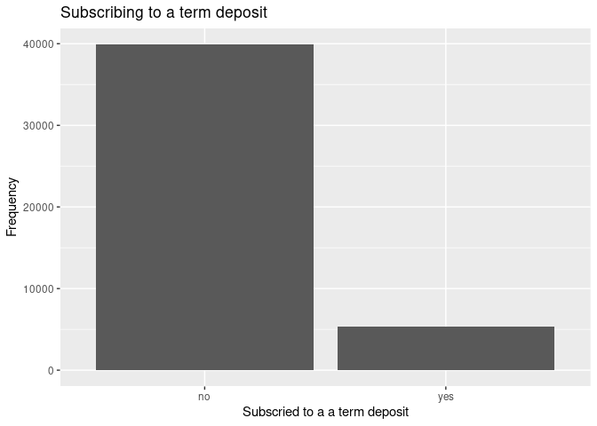

Project Proposal
================
Conquerors
2021-10-26

``` r
library(tidyverse)
library(broom)
library(readr)
```

## 1. Introduction

Fundamental Question: Which variables (or combinations of these) are the
most important indicators when determining whether an individual will
subscribe to a term deposit?

Data: Where it came from? The dataset “Banking Dataset - Marketing
Targets” by Prakhar Rathi contains data from a direct marketing campaign
by a Portuguese Banking Institution.

How it was collected? Clients were contacted by phone calls in order to
collect the data.

What are the cases? There are 45,211 cases with 17 variables

What are the variables variables;labelled: age, job, marital, education,
default, balance, housing, loan, contact, day, month, duration,
campaign, pdays, previous, poutcome, y.

The dataset “Banking Dataset - Marketing Targets” by Prakhar Rathi
contains data from a direct marketing campaign by a Portuguese Banking
Institution. Clients were contacted by phone calls in order to collect
the data.There are 45,211 cases with 17 variables;labelled: age, job,
marital, education, default, balance, housing, loan, contact, day,
month, duration, campaign, pdays, previous, poutcome, y.

## 2. Data

``` r
banking <- read_delim("/cloud/project/data/Banking Dataset.csv",
            delim = ";", escape_double = FALSE, trim_ws = TRUE)
```

    ## Rows: 45211 Columns: 17

    ## ── Column specification ────────────────────────────────────────────────────────
    ## Delimiter: ";"
    ## chr (10): job, marital, education, default, housing, loan, contact, month, p...
    ## dbl  (7): age, balance, day, duration, campaign, pdays, previous

    ## 
    ## ℹ Use `spec()` to retrieve the full column specification for this data.
    ## ℹ Specify the column types or set `show_col_types = FALSE` to quiet this message.

``` r
glimpse(banking)
```

    ## Rows: 45,211
    ## Columns: 17
    ## $ age       <dbl> 58, 44, 33, 47, 33, 35, 28, 42, 58, 43, 41, 29, 53, 58, 57, …
    ## $ job       <chr> "management", "technician", "entrepreneur", "blue-collar", "…
    ## $ marital   <chr> "married", "single", "married", "married", "single", "marrie…
    ## $ education <chr> "tertiary", "secondary", "secondary", "unknown", "unknown", …
    ## $ default   <chr> "no", "no", "no", "no", "no", "no", "no", "yes", "no", "no",…
    ## $ balance   <dbl> 2143, 29, 2, 1506, 1, 231, 447, 2, 121, 593, 270, 390, 6, 71…
    ## $ housing   <chr> "yes", "yes", "yes", "yes", "no", "yes", "yes", "yes", "yes"…
    ## $ loan      <chr> "no", "no", "yes", "no", "no", "no", "yes", "no", "no", "no"…
    ## $ contact   <chr> "unknown", "unknown", "unknown", "unknown", "unknown", "unkn…
    ## $ day       <dbl> 5, 5, 5, 5, 5, 5, 5, 5, 5, 5, 5, 5, 5, 5, 5, 5, 5, 5, 5, 5, …
    ## $ month     <chr> "may", "may", "may", "may", "may", "may", "may", "may", "may…
    ## $ duration  <dbl> 261, 151, 76, 92, 198, 139, 217, 380, 50, 55, 222, 137, 517,…
    ## $ campaign  <dbl> 1, 1, 1, 1, 1, 1, 1, 1, 1, 1, 1, 1, 1, 1, 1, 1, 1, 1, 1, 1, …
    ## $ pdays     <dbl> -1, -1, -1, -1, -1, -1, -1, -1, -1, -1, -1, -1, -1, -1, -1, …
    ## $ previous  <dbl> 0, 0, 0, 0, 0, 0, 0, 0, 0, 0, 0, 0, 0, 0, 0, 0, 0, 0, 0, 0, …
    ## $ poutcome  <chr> "unknown", "unknown", "unknown", "unknown", "unknown", "unkn…
    ## $ y         <chr> "no", "no", "no", "no", "no", "no", "no", "no", "no", "no", …

## 3. Data analysis plan

The outcome of this data(Y) is whether or not the client has subscribed
to the term deposit the bank is offering. The predictor(X) variables are
all the other variables in the dataset excluding Y which is the outcome
variable. Our question will be answered by determining which of these
variables are better predictors for this outcome.

We are not using any comparison groups because our data analysis
research question is not based on experiment testing but rather on
analyzing causation between different sets of variables.

``` r
ggplot(data = banking, mapping = aes(x = y))+
  geom_bar()+
   labs(
    x = "Subscried to a a term deposit",
    y = "Frequency",
    title = "Subscribing to a term deposit",
  )
```

<!-- -->

``` r
ggplot(data = banking, mapping = aes(x = y))+
  geom_bar()+
  facet_wrap(~job, nrow=2)+
   labs(
    x = "Subscried to a a term deposit",
    y = "Frequency",
    title = "Job vs Subscribing to a term deposit",
  )
```

<!-- -->

``` r
banking %>%
  ggplot(aes(x=balance)) +
  geom_histogram( bindwith = 5000) +
   facet_wrap(~y, scales = "free") +
ggtitle("Relationship between Balance and if the client subscribed to the term deposit") + xlab("Balance") + ylab("count")
```

    ## Warning: Ignoring unknown parameters: bindwith

    ## `stat_bin()` using `bins = 30`. Pick better value with `binwidth`.

<!-- --> The
statistical methods that could be used is finding the mean,median,
linear regression equation, standard deviation, a histogram, a box plot,
and a bar plot. Using the mean and median of numerical variables like
age, bank balance and duration of calls out of the people which
subscribed to the term deposit to approximate what is the ideal numeric
value for this variables. In addition, a histogram, box plot or bar plot
may be used to summarize discrete or continuous data that are measured
on an interval scale like the relationship between how age and marital
status affect the costumers decision.
