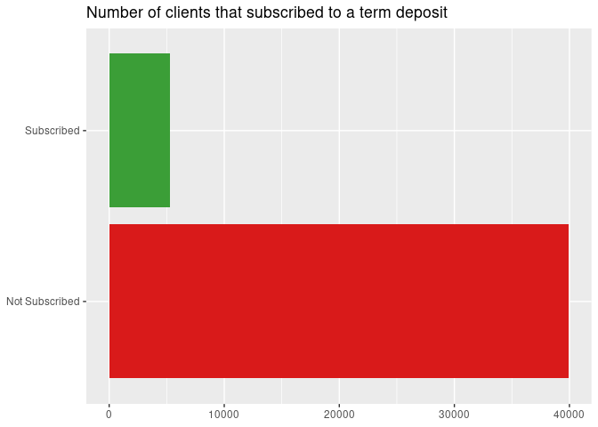
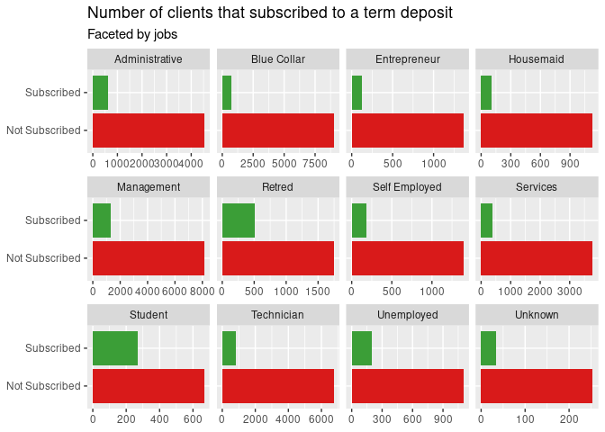
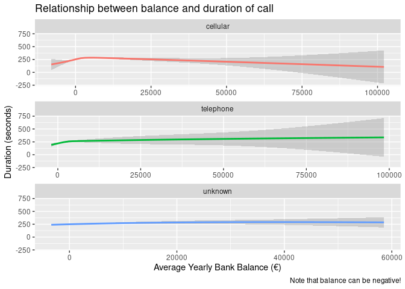

Project Proposal
================
Conquerors
2021-10-26

``` r
library(tidyverse)
library(broom)
library(readr)
```

## 1. Introduction

**Fundamental Question:** Which variables (or combinations of these) are
the most important indicators when determining whether an individual
will subscribe to a term deposit?

**Data:**

The data set “Banking Dataset - Marketing Targets” by Prakhar Rathi
contains data derived from *S. Moro, P. Cortez and P. Rita.-A
Data-Driven Approach to Predict the Success of Bank Telemarketing*. The
original data collection comes from the 2008-2013 records of a
Portuguese Banking Institution and their success in convincing clients
to subscribe to term deposits.

**How was it collected?**

The data was collected directly from the bank’s records through a
semi-outomatic feature selection and DM models.

\***What are the cases?**

There are 45,211 cases with 17 variables

**What are the variables?**

The variables are labelled: age, job, marital, education, default,
balance, housing, loan, contact, day, month, duration, campaign, pdays,
previous, poutcome, y (*Check README file in data folder for further
description*).

**Original use of data:**

This data set was originally created to make a prediction model through
machine learning that could determine whether newly-contacted clients
would subscribe to term deposits.

## 2. Data

``` r
banking <- read_delim("/cloud/project/data/Banking Dataset.csv",
            delim = ";", escape_double = FALSE, trim_ws = TRUE)
```

    ## Rows: 45211 Columns: 17

    ## ── Column specification ────────────────────────────────────────────────────────
    ## Delimiter: ";"
    ## chr (10): job, marital, education, default, housing, loan, contact, month, p...
    ## dbl  (7): age, balance, day, duration, campaign, pdays, previous

    ## 
    ## ℹ Use `spec()` to retrieve the full column specification for this data.
    ## ℹ Specify the column types or set `show_col_types = FALSE` to quiet this message.

``` r
glimpse(banking)
```

    ## Rows: 45,211
    ## Columns: 17
    ## $ age       <dbl> 58, 44, 33, 47, 33, 35, 28, 42, 58, 43, 41, 29, 53, 58, 57, …
    ## $ job       <chr> "management", "technician", "entrepreneur", "blue-collar", "…
    ## $ marital   <chr> "married", "single", "married", "married", "single", "marrie…
    ## $ education <chr> "tertiary", "secondary", "secondary", "unknown", "unknown", …
    ## $ default   <chr> "no", "no", "no", "no", "no", "no", "no", "yes", "no", "no",…
    ## $ balance   <dbl> 2143, 29, 2, 1506, 1, 231, 447, 2, 121, 593, 270, 390, 6, 71…
    ## $ housing   <chr> "yes", "yes", "yes", "yes", "no", "yes", "yes", "yes", "yes"…
    ## $ loan      <chr> "no", "no", "yes", "no", "no", "no", "yes", "no", "no", "no"…
    ## $ contact   <chr> "unknown", "unknown", "unknown", "unknown", "unknown", "unkn…
    ## $ day       <dbl> 5, 5, 5, 5, 5, 5, 5, 5, 5, 5, 5, 5, 5, 5, 5, 5, 5, 5, 5, 5, …
    ## $ month     <chr> "may", "may", "may", "may", "may", "may", "may", "may", "may…
    ## $ duration  <dbl> 261, 151, 76, 92, 198, 139, 217, 380, 50, 55, 222, 137, 517,…
    ## $ campaign  <dbl> 1, 1, 1, 1, 1, 1, 1, 1, 1, 1, 1, 1, 1, 1, 1, 1, 1, 1, 1, 1, …
    ## $ pdays     <dbl> -1, -1, -1, -1, -1, -1, -1, -1, -1, -1, -1, -1, -1, -1, -1, …
    ## $ previous  <dbl> 0, 0, 0, 0, 0, 0, 0, 0, 0, 0, 0, 0, 0, 0, 0, 0, 0, 0, 0, 0, …
    ## $ poutcome  <chr> "unknown", "unknown", "unknown", "unknown", "unknown", "unkn…
    ## $ y         <chr> "no", "no", "no", "no", "no", "no", "no", "no", "no", "no", …

## 3. Data analysis plan

The outcome of this data (Y) is whether or not the client has subscribed
to the term deposit the bank is offering. The predictor(X) variables are
all the other variables in the data set excluding Y which is the outcome
variable. Our question will be answered by determining which of these
variables are better predictors for this outcome.

We are not using any comparison groups because our data analysis
research question is not based on experiment testing but rather on
analyzing correlation and causation between different sets of variables
that have all been pre-recorded.

**Preliminary Data Analysis:**

This first metric is used to observe the overall success of the bank
marketing campaign.

``` r
banking %>%
  mutate(y=fct_recode(y, Subscribed= "yes", 
        `Not Subscribed` = "no")) %>%
ggplot(aes(y = y,fill= y)) +
  geom_bar() +
  guides(fill = "none") +
  scale_fill_manual(values = c("Subscribed"="#3b9e37", 
                              "Not Subscribed"="#d91a1a")) +
   labs(
    x = NULL,
    y = NULL,
    title = "Number of clients that subscribed to a term deposit",
  )
```

<!-- -->

Could the client’s jobs have an impact on whether they subscribe to term
deposits?

``` r
banking %>%
mutate(
  job= fct_recode(job, Administrative = "admin.",
                  Management = "management", 
                  Entrepreneur= "entrepreneur",
                  `Blue Collar` = "blue-collar", 
                  Housemaid = "housemaid", 
                  Technician = "technician" , 
                  Services = "services", 
                  Student = "student" , 
                  `Self Employed`= "self-employed", 
                  Unemployed = "unemployed", 
                  Unknown= "unknown", 
                  Retred = "retired" ),
  y=fct_recode(y, Subscribed= "yes", 
               `Not Subscribed` = "no")) %>%
ggplot(aes(y = y,fill= y)) +
  geom_bar() +
  guides(fill = "none") +
  scale_fill_manual(values = c("Subscribed"="#3b9e37", 
                               "Not Subscribed"="#d91a1a")) +
  facet_wrap(.~job, scales = "free_x") +
  labs(
    x = NULL,
    y = NULL,
    title = "Number of clients that subscribed to a term deposit",
    subtitle= "Faceted by jobs"
  )
```

<!-- -->

Comparing two continuous variables such as Bank Balance and Duration of
Call could help us determine whether the bank’s marketing campaign
placed more emphasis on clients with very large balances or negative
ones (clients in need or with dept). Perhaps more effort was given to
these groups of clients?

``` r
banking %>%
  group_by(contact) %>%
  summarize(balance,duration) %>%
  ggplot(aes(x=balance,y=duration,color= contact)) +
  geom_smooth() +
  guides(color = "none") +
  facet_wrap(~contact,nrow = 3, scales = "free_x") +
labs(
  title= "Relationship between balance and duration of call",
  x= "Average Yearly Bank Balance (€)",
  y= "Duration (seconds)",
  caption= "Note that balance can be negative!"
  )
```

    ## `summarise()` has grouped output by 'contact'. You can override using the `.groups` argument.

    ## `geom_smooth()` using method = 'gam' and formula 'y ~ s(x, bs = "cs")'

<!-- -->

**Statistical Methods**

Some of the statistical methods that could be used in finding an answer
to our question are mean,median, standard deviation and regression
analysis. Statistical visualization tools such as histograms, bar plot,
dot plots, ridge plots, density plots and lines of best fit could also
be used.

Using the mean and median of numerical variables like age, bank balance
and duration of calls out of the people which subscribed to the term
deposit to approximate what is the ideal numeric value for this
variables. In addition, plots and graphs may be used to visualize
discrete or continuous data like the relationship between how age and
marital status affect the costumer’s decision. Regression analysis can
be used to estimate the relation between all other variables and our
outcome variable.
